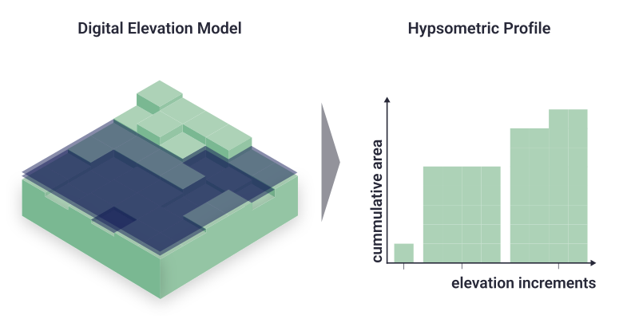

```@meta
CollapsedDocStrings = true
Description = "DIVACoast.jl is a Julia library for coastal impact and adaptation modelling. The library provides data types and algorithms to quickly script assessments for different **coastal impact and adaptation** research questions. DIVACoast.jl is provided by the [Global Climate Forum](https://globalclimateforum.org/) via [GitHub](https://github.com/globalclimateforum/DIVACoast.jl)."
```
# Flood exposure
Currently the main way to represent exposure in `DIVACoast.jl` is as `HypsometricProfile`. This is a special kind of coastal profile that allows for a very efficient computation of flood damages, which is beneficial for running large number of damage assessments as, e.g., required for many economic questions that involve optimization. In addition, `DIVACoast.jl` supports representing exposure via two dimensional grids, in which each grid cell is mapped to its elevation (or hydrological connectivity), as well as a set of exposure variables such as area, people or assets. `DIVACoast.jl` represents such gridded exposure as `SparseGeoArrays`. Functions are also provided to convert gridded exposure data to hypsometric profiles.

## Hypsometric Profiles


A hypsometric profile represents a cross-section of the coastal zone, mapping elevation to the cumulative exposure below that elevation. It is calculated by incrementally increasing the water level and accumulating the exposures and exposed area at each step. For further analysis on the `HypsometricPofil` exposure values are linear interpolated between the initial waterlevel increments.

A `HyposmetricProfile` holds two different types of exposure:
1. **Static Exposure**, which is exposure that **cannot be relocated**. An example is land (area). 
2. **Dynamic Exposure**, which is exposure that **can be relocated or adapted over time**. Examples are people, who may move to higher elevations, or assets depreciating as mean and extreme sea-levels come closer over time.

### Constructing Hypsometric Profiles

Currently, Hypsometric Profiles can constructed directly through a constructor, or indirectly from a NetCDF file.

```@docs
Main.DIVACoast.HypsometricProfile
Main.DIVACoast.load_hsps_nc
Main.DIVACoast.to_hypsometric_profile
Base.:+
Main.DIVACoast.unit
Main.DIVACoast.compress!
```

### Querying Hypsometric Profiles
```@docs
Main.DIVACoast.exposure
```
### Modifying Hypsometric Profiles
Socio-economic development and adaptation changes exposure. For example, socio-economic growth increases the number of people and their assets in the coastal zone, while retreat reduces assets and people in the costal zone. To represent those process in DIVACoast, we provide the following functions.

```@docs
Main.DIVACoast.multiply_exposure!
Main.DIVACoast.multiply_exposure_above!
Main.DIVACoast.multiply_exposure_below!
Main.DIVACoast.remove_exposure_below!
Main.DIVACoast.add_exposure_between!
Main.DIVACoast.add_exposure_variable!
Main.DIVACoast.remove_exposure_variable!
Main.DIVACoast.add_exposure_above!
Main.DIVACoast.land_raising!
```

## Two-dimensional gridded exposure
Currently, `DIVACoast.jl` only provides limited support for representing coastal exposure on a two-dimensional (2D) grid, but this **will be added in future** releases. In the current release, the main purpose of representing two-dimensional exposure data is to convert these to hypsometric profiles.
