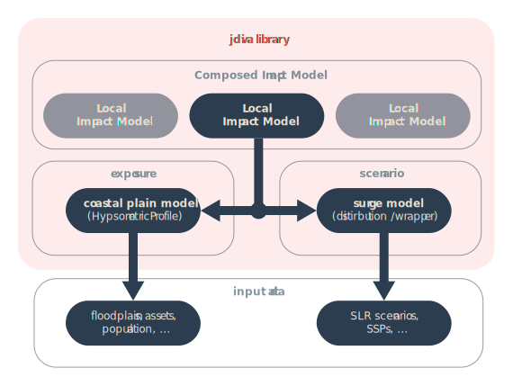

># jdiva
>jdiva is a julia library for economic modelling of coastal sea-level rise impacts and adaptation. It provides a complete tool chain from geodatatypes to datatypes that allow different approaches of coasplain modelling to algorithms that compute flood impacts, erosion and wetland change.<br>jdiva is provided by: [Global Climate Forum](https://globalclimateforum.org)
># Concept
>
>The jdiva library follows a hierarchical and modular structure. At the top of the structure is the `ComposedImpactModel`, a data structure that contains several `LocalCoastalImpactModel`s. Each `LocalCoastalImpactModel` consists of an 'exposure' module and a 'scenario' module. The main data structure behind the 'exposure' module is the `HypsometricProfile`. This data structure not only holds the elevation variable of the model but also connects elevation with certain assets, such as population and monetary assets. The 'scenario' module, on the other hand, handles future socio-economic and/or sea level rise scenarios in the form of distributions or by using implemented SLR-/SSP-wrappers.

# Data structures

## Impact Model
```@docs
Main.jdiva.ComposedImpactModel
Main.jdiva.LocalCoastalImpactModel
```

## Hypsometric Profile

```@docs
Main.jdiva.HypsometricProfile
```

### Construct
```@docs
Main.jdiva.load_hsps_nc
```

### Modify
```@docs
Main.jdiva.add_static_exposure!
Main.jdiva.add_dynamic_exposure!
Main.jdiva.remove_static_exposure!
Main.jdiva.remove_dynamic_exposure!
Main.jdiva.sed
Main.jdiva.sed_above
Main.jdiva.sed_below
Main.jdiva.remove_below
Main.jdiva.add_above
Main.jdiva.add_between
Main.jdiva.compress!
```

### Get Damage
```@docs
Main.jdiva.expected_damage_bathtub_standard_ddf
Main.jdiva.expected_damage_bathtub
```

### Get Exposure
```@docs
Main.jdiva.exposure_below_bathtub
Main.jdiva.exposure_below_attenuated
Main.jdiva.attenuate
```

### Addional
```
Main.jdiva.distance
```

## Wrapper
### SLRWrapper
```@docs
Main.jdiva.SLRWrapper
Main.jdiva.get_slr_value
```

### SSPWrapper
```@docs
Main.jdiva.SSPWrapper
```

### Statistics

```@docs
Main.jdiva.estimate_gumbel_distribution
Main.jdiva.estimate_frechet_distribution
Main.jdiva.estimate_gev_distribution
Main.jdiva.estimate_weibull_distribution
```

## SparseGeoArray (SGA)
```@docs
Main.jdiva.SparseGeoArray
```

### Indexing
```@docs
Main.jdiva.getindex
Main.jdiva.coords
Main.jdiva.indices
Main.jdiva.nh4
Main.jdiva.nh8
Main.jdiva.distance
Main.jdiva.go_direction
Main.jdiva.bounding_boxes
Main.jdiva.area
```

### Operations
```@docs
Main.jdiva.emptySGAfromSGA
Main.jdiva.get_extent
Main.jdiva.sga_union
Main.jdiva.sga_intersect
Main.jdiva.sga_diff
Main.jdiva.sga_summarize_within
Main.jdiva.minumum_mean
Main.jdiva.get_closest_value
Main.jdiva.get_box_around
```

### Projection & Transformation
```@docs
Main.jdiva.epsg2wkt
Main.jdiva.proj2wkt
Main.jdiva.str2wkt
Main.jdiva.epsg!
Main.jdiva.is_rotated
```

### Modify
```@docs
Main.jdiva.bbox!
```


