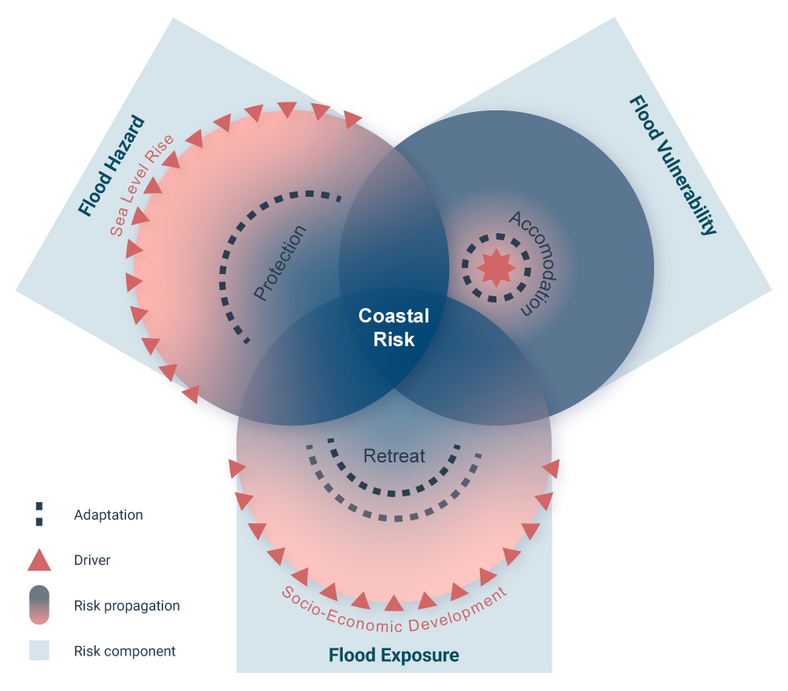

# About
DIVACoast.jl is a Julia library for coastal impact and adaptation modelling. The library provides data types and algorithms to quickly script assessments for different **coastal impact and adaptation** research questions. DIVACoast.jl is provided by the [Global Climate Forum](https://globalclimateforum.org/) via [GitHub](https://github.com/globalclimateforum/DIVACoast.jl).

---

# Getting Started

Ensure you have Julia installed on your system. You can download Julia from the official [julia website](https://julialang.org). DIVACoast is currently under Development you can install the latest (**unstable**) version from GitHub. 

```julia
using Pkg
Pkg.add(url = "https://github.com/globalclimateforum/DIVACoast.jl")
using DIVACoast
```

---

# Concept

The key concept of `DIVACoast.jl` is the concept of risk. Following the definition of the Intergovernmental Panel on Climate Change (IPCC), risk constituted by the three components of hazard, exposure and vulnerability (Oppenheimer et al., 2019; Wong et al., 2014). While on the long run the package is meant to serve multiple coastal risks including the risk of flooding, erosion, salinity intrusion and wetland change, the current release concentrates on flood risk. 

## Flood Risk


Coastal flood risk assessment involves at least the following five components: 

1. **Sea-level hazard**, including mean sea-levels (MSL) and extreme sea-levels (ESL) from tides, surges, waves, river run-off and their interactions.

2. **Hazard propagation**, which refers to the transformation of the **sea-level hazard** to the **flood hazard**. This includes the propagation of mean and extreme sea-level onto the shore and the floodplain, including their interaction with natural (e.g., dunes) and artificial (e.g., dikes) defences.

3. **Flood hazard**, refers to the flood characteristics found at a specific flooded location. Currently `DIVACoast.jl` is limited to the characteristic of maximum water depth.

4. **Flood exposure** in terms of area, people and coastal assets potentially threatened by these hazards.

4. **Flood vulnerability**, which refers to the  propensity of the exposure to be adversely affected by the flood hazard (IPCC, 2014b).

These components together form the basis for assessing coastal flood risk, and provide a structured approach to analyze how hazards, exposure, and vulnerability interact. The following table summarizes how different processes—such as drivers and adaptation strategies—can influence these risk components:


| Process                    | Interaction                      |
| -------------------------- | -------------------------------- |
| **Drivers**                |                                  |
| Sea-Level rise             | changes the hazard               |
| Socio-Economic development | changes Exposure & Vulnerability |
| **Adaptation**             |                                  |
| Protection                 | affects the hazard propagation   |
| Retreat                    | reduces exposure                 |
| Accommodate                | reduces vulnerability            |

In the following sections you will find a broad "toolset" for modeling coastal risk components and their related interactinc processes.

---

# Sea-Level hazard

Currently sea-level hazards in `DIVACoast.jl` are represented trough extreme still water level distributions. These distributions are implemented as `Distributions` of the Julia Package `Distributions.jl`. As ESL are often provided as non-parametric (i.e. empirical) distributions, i.e. point-wise as a list of water levels and associated return periods, `DIVACoast.jl` provides a couple of functions that convert these **non-parametric distributions** to a chosen **parametric extreme value distribution**. 

```@docs
Main.DIVACoast.estimate_gumbel_distribution
Main.DIVACoast.estimate_frechet_distribution
Main.DIVACoast.estimate_gev_distribution
Main.DIVACoast.estimate_weibull_distribution

Main.DIVACoast.estimate_gpd_negative_distribution
Main.DIVACoast.estimate_gpd_positive_distribution
Main.DIVACoast.estimate_gp_distribution
Main.DIVACoast.estimate_exponential_distribution

Main.DIVACoast.plot_comparison_extreme_distributions
```
---

# Flood exposure
Currently the main way to represent exposure in `DIVACoast.jl` is as `HypsometricProfile`. This is a special kind of coastal profile that allows for a very efficient computation of flood damages, which is beneficial for running large number of damage assessments as, e.g., required for many economic questions that involve optimization. In addition, `DIVACoast.jl` supports representing exposure via two dimensional grids, in which each grid cell is mapped to its elevation (or hydrological connectivity), as well as a set of exposure variables such as area, people or assets. `DIVACoast.jl` represents such gridded exposure as `SparseGeoArrays`. Functions are also provided to convert gridded exposure data to hypsometric profiles.

## Hypsometric Profiles


A hypsometric profile represents a cross-section of the coastal zone as a function that maps elevation to  the cumulative exposure below this elevation. Hyposmetric profiles are derived from a Digital Elevation Model (DEM) considering hydrological connectivity.

```
add math.
```

A `HyposmetricProfile` holds two different types of exposure:
1. **Static Exposure**, which is exposure that **cannot be relocated**. An example is land (area). 
2. **Dynamic Exposure**, which is exposure that **can be relocated or adapted over time**. Examples are people, who may move to higher elevations, or assets depreciating as mean and extreme sea-levels come closer over time.

### Constructing Hypsometric Profiles

Currently, Hypsometric Profiles can constructed directly through a constructor, or indirectly from a NetCDF file.

```@docs
Main.DIVACoast.HypsometricProfile
Main.DIVACoast.load_hsps_nc
Main.DIVACoast.to_hypsometric_profile
Base.:+
Main.DIVACoast.unit
Main.DIVACoast.compress!
```

### Querying Hypsometric Profiles
```@docs
Main.DIVACoast.exposure
```
### Modifying Hypsometric Profiles
Socio-economic development and adaptation changes exposure. For example, socio-economic growth increases the number of people and their assets in the coastal zone, while retreat reduces assets and people in the costal zone. To represent those process in DIVACoast, we provide the following functions.

```@docs
Main.DIVACoast.multiply_exposure!
Main.DIVACoast.multiply_exposure_above!
Main.DIVACoast.multiply_exposure_below!
Main.DIVACoast.remove_exposure_below!
Main.DIVACoast.add_exposure_between!
Main.DIVACoast.add_exposure_variable!
Main.DIVACoast.remove_exposure_variable!
Main.DIVACoast.add_exposure_above!
```

## Two-dimensional gridded exposure
Currently, `DIVACoast.jl` only provides limited support for representing coastal exposure on a two-dimensional (2D) grid, but this **will be added in future** releases. In the current release, the main purpose of representing two-dimensional exposure data is to convert these to hypsometric profiles.

# Flood damage assessment

## Flood propagation model
Currently `DIVACoast.jl` supports the **bathtub model** and the **attenuated bathtub model**. Attenuation refers to the reduction of water levels while floods propagate inland across the landscape. The magnitude of attenuation is a function of land cover such as vegetation, buildings and infrastructure which slow down and hence reduce the extent of flooding.

```@docs
Main.DIVACoast.expected_damage_bathtub_standard_ddf
Main.DIVACoast.expected_damage_bathtub
Main.DIVACoast.damage_bathtub_standard_ddf
Main.DIVACoast.damage_bathtub
```

# Coastal models
`DIVACoast.jl` also provides the higher-level data structures of Coastal Models, which provide a range of higher-level convenience functions to handle large ensembles of coastal risk assessment. The data structure of `CoastalModel` thereby combines hazard, exposure, vulnerabilty information for a given type of hazard. Several Coastal Models can further be combined into a `CompositeCoastalModel`. Currently, the only type of Coastal Model available is the `CoastalFloodModel`, which is further described below. Future versions of the library will also contain other types of Coastal Models such as, e.g., `CoastalErosionModel` and `CoastalWetlandsModel`.

## Coastal Flood model
A `CoastalFloodModel` combines all information necessary for computing flood exposure and damage including sea-level hazard, attenuation model, exposure and vulnerability. 

```@docs
Main.DIVACoast.LocalCoastalImpactModel
Main.DIVACoast.ComposedImpactModel
```

A `CoastalFloodModel` is defined as

```julia
mutable struct CoastalFloodModel{DT<:Real,IDT,DATA} <: CoastalImpactUnit
  id::IDT
  surge_model::Distribution
  coastal_plain_model::HypsometricProfile{DT}
  protection_level::Real
  data::DATA
end
```

---

# Drivers
`DIVACoast.jl` provides convenient data readers for external drivers such as sea-level rise and socio-economic development. These readers provide values for any future point in time by **interpolating** piecewise linearly between time steps and **extrapolating** linearly from the last available time step. All readers also provide growth rates between two points in time. Growth rates can be returned in three different ways as AnnualGrowthPercentage, AnnualGrowth, GrowthFactor. The readers can be used with the `get_value()` and `get_value_from_cell()` functions to retrieve the relevant data. The reader takes a **NetCDF** file as input, which must include the following dimensions:

1. **Variable**: The specific variable you want to access (e.g., Sea Level Rise in meters).
2. **Longitude and Latitude**: Dimensions specifying the longitude and latitude for each grid cell in the NetCDF file.
3. **Time**: Time dimension, e.g., 5-year increments.
4. **Quantiles**: Quantiles associated with the variable.

```@docs
Main.DIVACoast.SSPScenarioReader
Main.DIVACoast.SLRScenarioReader
Main.DIVACoast.get_slr_value
Main.DIVACoast.get_slr_value_from_grid_cell
```
---

# GeoData

## SparseGeoArray (SGA)
Within `DIVACoast.jl`, **Gridded geodata** is stored and processed using the `SparseGeoArray` data structure. This structure retains the necessary geospatial meta-information for accurate referencing and stores the data in a memory-efficient sparse array format. By storing only non-empty grid cells, it is well-suited for coastal datasets, where large areas—such as open ocean or inland regions—often contain no or non relevant data for the analysis.

```@docs
Main.DIVACoast.SparseGeoArray
```
### SparseGeoArrays - Construct 
`SparseGeoArrays` can be constructing by multiple ways:

**From GeoTIFF**
```julia
Main.DIVACoast.SparseGeoArray{Float32, Int32}("path/to/file.tif")
```

**Construct (empty)**<br>
**Note:** _If you init an empty `SparseGeoArray` you need to specify the geospatial-metadata yourself to perform geo-Operations._
```julia 
Main.DIVACoast.SparseGeoArray{Float32, Int32}()
sga[(x, y)] = value # Fill the SparseGeoArray
```
**Construct (empty)** with meta-information **from another** `SparseGeoArray`
```@docs
Main.DIVACoast.emptySGAfromSGA
```

**Manually** construct a `SparseGeoArray`<br>
If you have your data as a dictionary and know the georeferencing, you can construct it directly:
```julia
sga = Main.DIVACoast.SparseGeoArray(
    data,          # Dict{Tuple{Int,Int}, Float64}
    nodatavalue,   # e.g., -9999.0
    affine_map,    # CoordinateTransformations.AffineMap
    crs,           # GeoFormatTypes.WellKnownText
    metadata,      # Dict{String,Any}
    xsize, ysize,  # grid dimensions
    projref,       # projection string
    circular,      # Bool
    filename       # String
)
```

### SparseGeoArray - Operations
A set of core spatial operations is provided for `SparseGeoArray` objects, enabling manipulation and analysis of gridded exposure data. These functions allow you to combine, compare, and summarize spatial datasets efficiently:

```@docs
Main.DIVACoast.sga_union
Main.DIVACoast.sga_intersect
Main.DIVACoast.sga_diff
Main.DIVACoast.sga_summarize_within
```

There are multiple options to access the data based on an index or on a coordinate.

#### Indexing `SparseGeoArrays`
```@docs
Main.DIVACoast.getindex
Main.DIVACoast.coords
Main.DIVACoast.indices
```

#### Neighbourhood and Distance Functions
```@docs
Main.DIVACoast.nh4
Main.DIVACoast.nh8
Main.DIVACoast.distance
Main.DIVACoast.go_direction
```

#### Spatial Extent
```@docs
Main.DIVACoast.bounding_boxes
Main.DIVACoast.area
Main.DIVACoast.get_extent
```

#### Coordinate Reference System (CRS)
```@docs
Main.DIVACoast.epsg2wkt
Main.DIVACoast.proj2wkt
Main.DIVACoast.str2wkt
Main.DIVACoast.epsg!
Main.DIVACoast.is_rotated
Main.DIVACoast.bbox!
```

## GeoTIFF
As described above `SparseGeoArray` is the structure used by `DIVACoast.jl` to handle GeoData. In addition, `DIVACoast.jl` provides several functions
to read, modify and export files in the common GeoData Format `.geotiff`.

### Operations
The following operations process (multiple) GeoTIFF rasters using a user-defined function, enabling custom analysis or aggregation across several input files.

| Function            | Inputs              | Output   | Operation                                                              |
| ------------------- | ------------------- | -------- | ---------------------------------------------------------------------- |
| `geotiff_connect`   | 2 rasters, function | 1 raster | Combine two rasters pixel-wise using a function                        |
| `geotiff_transform` | 1 raster, function  | 1 raster | Transform one raster pixel-wise using a function                       |
| `geotiff_collect`   | mask, rasters, func | (custom) | Collect values from multiple rasters and mask, process with a function |

```@docs
Main.DIVACoast.geotiff_connect
Main.DIVACoast.geotiff_transform
Main.DIVACoast.geotiff_collect
```

## Point Data
GeoData is often provided by coordinates. In most cases you can transform the provided data into a `DataFrame` object with a coordinate or langitude and latitude column. `DIVACoast.jl` provides a structure called `Neighbour` to perform Nearest Neighbour searches on `DataFrames` in a convinient and efficient way.

```@docs
Main.DIVACoast.Neighbour
```
Nearest Neighbour search can be performed using:

```@docs
Main.DIVACoast.nearest
Main.DIVACoast.nearest_coord
```

---